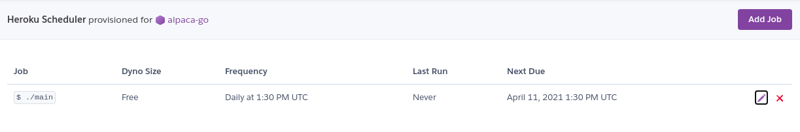

# Alpaca Go Heroku

### Usage

  - [Fork this on github](https://github.com/earlonrails/alpaca-go-heroku/fork)
  - Update the `rebalance` method in the main.go file to your own algorithm
  - `heroku login`
  - `heroku create alpaca-go`
  - `heroku stack:set container`
  - `heroku config:set APCA_API_KEY_ID=[YOUR_API_KEY_HERE]`
  - `heroku config:set APCA_API_SECRET_KEY=[YOUR_API_SECRET_HERE]`
  - `heroku config:set STOCK=[YOUR_TARGET_STOCK]`
  - `heroku addons:create heroku-scheduler --app alpaca-go`
  - `heroku addons:open scheduler`
  - Add a job like this:
    
  - :warning: Enable live trading `heroku config:set BASE_URL=https://api.alpaca.markets`
  - `git push heroku master`
